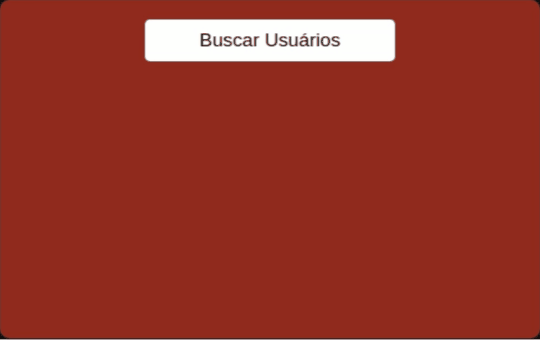

# 
 Consumindo API no front e Back end 

Consumindo API criada no backend que essa condume outra api para buscar usuários fakes JSONPlaceholder, seguindo tutorial do vídeo - [_Consumindo API no Front e no Back-end | CodeDrops #45_](https://www.youtube.com/watch?v=vYlz3SmNXQQ&list=PL85ITvJ7FLoifcDIBeuuAhh4_799RZaSc&index=12&ab_channel=Rocketseat)

  

