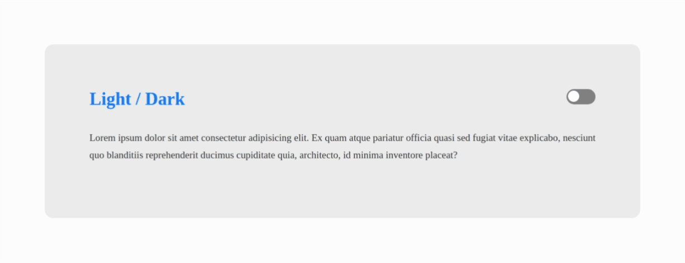

# 
 DarkMode com JavaScript 

DarkMode utilizando JavaScript com manipulação de variaveis CSS, vídeo utilizado do tutorial - [_Dark Mode raiz com CSS e JavaScript | Code/Drops #24_](https://www.youtube.com/watch?v=BvhYm0BOLvA&list=PL85ITvJ7FLoifcDIBeuuAhh4_799RZaSc&index=23&ab_channel=Rocketseat)

  

