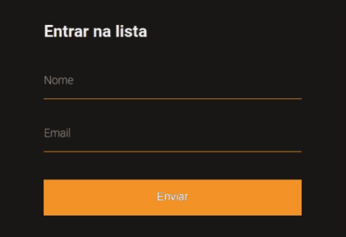

# 
 Validação de formulário com JavaScript Puro e HTML API 

Criando validações de campos e mensagens personalizadas para indicar o erro, utilizando o API de validação do HTML, código seguindo o tutorial - [_Validação de forms customizada com HTML e JavaScript | Code/Drops #32_](https://www.youtube.com/watch?v=GTMEuHxh8aQ&list=PL85ITvJ7FLoifcDIBeuuAhh4_799RZaSc&index=19&ab_channel=Rocketseat)

  

