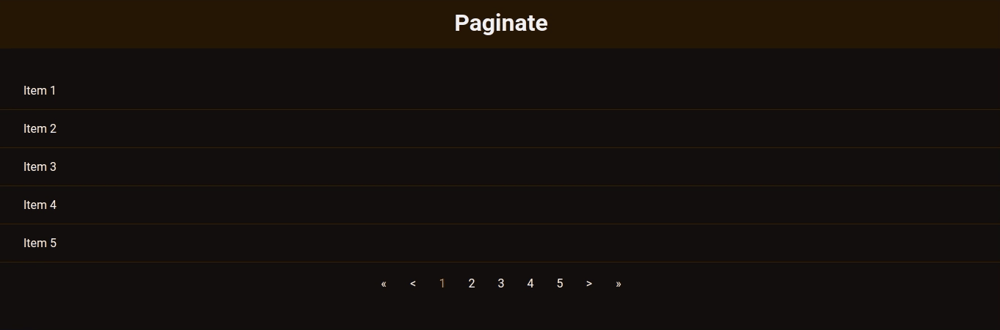

# 
 Paginação com JavaScript Puro 

Criação da logica de uma paginação com controle de limite de itens por paixas e quantidade de botões a serem exibido da paginação, código seguindo o tutorial - [_Paginação no Front End com JS puro | Code/Drops #43_](https://www.youtube.com/watch?v=6-VDE3H9-WU&list=PL85ITvJ7FLoifcDIBeuuAhh4_799RZaSc&index=15&ab_channel=Rocketseat)

  

